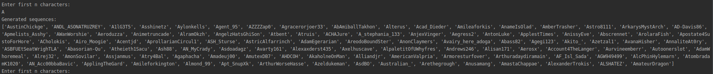

# Introduction
Recurrent neural nets (RNNs) are powerful models to work with sequential 
data such as text or time series. Specifically, they can be used to 
predict the next element in the sequence given previous elements.

The purpose of this project was to train a relatively powerful LSTM 
(which is a more powerful version of the RNN) and see how well can 
it fit data such as English words and a set user names. The results 
are shared here in a form of pre-trained LSTM models and interactive 
script to let one check their output.

This repository contains few pre-trained models, a script 'sample.py' 
to sample sequences using those models and yet another script 'train.py' 
to train a model on your own data. One model was trained on 5000 most 
frequent English words, the other was trained on 10000 user names.

# Installation

Clone the repository in local directory, go inside this directory, 
install all dependencies via pip,

```
pip install -r requirements.txt
```

# Quick Start

## Sampling from pre-trained models

In order to sample from a pre-trained model, execute 'sample.py' script.
After running this command, the model will load its weights and you will 
see the prompt inviting you to enter any initializing (seeding) character 
sequence.

The model will then generate (hallucinate) the rest of the 
sequence in accordance with a learned probability distribution of the 
next character given preceding ones.

Sample characters from english words model (generates words):
```
python sample.py --weights_path 'pre_trained_models/english_words_5000.h5'
```

Sample characters from user names model (generates user names):
```
python sample.py --weights_path 'pre_trained_models/user_names_10000.h5'
```

## Training a new model

Prepare a text file containing sequences, one sequence per line.

Train a model for 10 epochs with a mini-batch size of 32 on 1000 
sequences stored in 'sequences.txt', limit sequences to be 8 characters 
long, set white-space as a sentinel, use 3 LSTM layers with 32 hidden 
units each, save the model in file 'incognito_model.h5'.
```
python train.py --loader_class 'SequenceLoader' --sequence_path 'sequences.txt' --num_sequences 1000 --max_len 8 --sentinel ' ' --units 32 --layers 3 --batch_size 32 --epochs 10 --save_path 'incognito_model.h5'
```

# Few generated samples




# Additional details on training

Depending on the type of sequences, there are 3 different loaders to use
for training.

SequenceLoader is a generic loader which will expect a text file 
containing lines with any sequence of characters, one sequence per row. 

Use loader with a class name VocabularyLoader when your sequences 
represent English words and you want to train the model only on n 
(say, 1000) most frequently used.

UserNameLoader is quite narrow in its capabilities. It expects a 
CSV file with a very simple structure. Specifically, the loader will 
ignore the first line and it will only take sequences stored in the 
first column in each row.

# License
This project is licensed under the MIT License.
